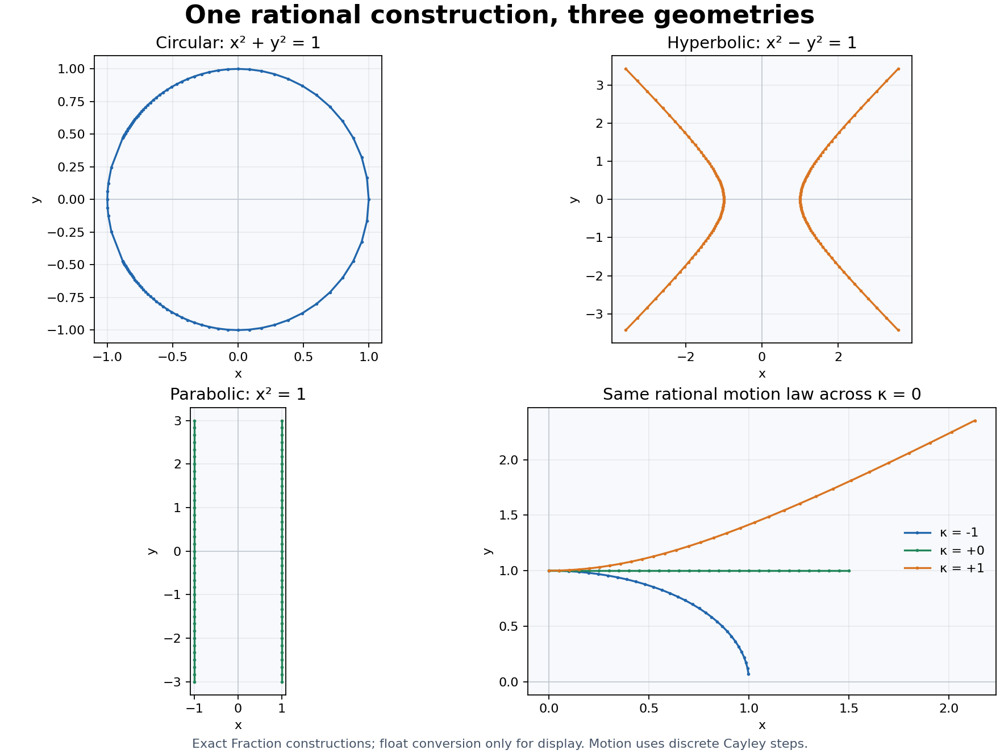

# Ultracomplex Math

**Circular, hyperbolic and parabolic geometry — united in one eight-dimensional algebra.**

A Python library by **Philipp Kolodziej** for exploring what these geometries can do together: exact rational constructions, mixed trigonometry, rotations, boosts, shears, coupled motion and projective transformations. Derivatives arise naturally from the same structure.

$$\mathcal A_K=K[i,j,\varepsilon]/(i^2+1,\;j^2-1,\;\varepsilon^2),\qquad ij=ji,\quad i\varepsilon=\varepsilon i,\quad j\varepsilon=\varepsilon j.$$

Choose numerical real coefficients (`Ultra`) or exact rational coefficients (`ExactUltra`). The mixed directions `ij`, `eps*i`, `eps*j` and `eps*i*j` are first-class parts of the same number. The goal is a coherent mathematical toolbox that brings the strengths of all three algebras into shared computations.

[Get started](docs/getting-started.md) · [Documentation](docs/README.md) · [Showcase](docs/gallery/README.md) · [Research agenda](docs/research/README.md)

The [geometry inside the full union](docs/research/geometric-structure.md) explains its complete polar form, the shared structure of oscillators and optical systems, and its projective connection to a tangent quadric. It separates mathematical derivations from implemented APIs.



## See the union at work

| Explore | What comes together | Run from a checkout |
| --- | --- | --- |
| [Exact geometry](docs/unified-geometry.md) | Rational rotations, boosts, shears, intersections and projective maps | `python -m examples.exact_geometry --plot` |
| [Coupled motion](docs/gallery/README.md#coupled-motion-and-sensitivity) | Complex phase, split coupling and dual parameter derivatives | `python -m examples.gallery --only coupling` |
| [Waves and inverse problems](docs/gallery/applications.md) | Travelling waves, robot Jacobians and interference-based geometry recovery | `python -m examples.applications` |
| [Trigonometric atlas](docs/gallery/README.md#trigonometry-and-angles) | The same function in circular, hyperbolic, parabolic and mixed directions | `python -m examples.gallery --only cosine` |
| [Geometric structure](docs/research/geometric-structure.md) | Full polar form, critical motion, polarization and projective tangent geometry | `python tools/geometric_structure_probe.py` |


The [offline interactive lab](docs/gallery/lab.html) explores motion and sensitivity. Download the HTML and open it locally; GitHub displays its source. Every numerical plot is reproducible, with model assumptions and independent checks in the showcase.

## Try it

Python **3.12+**. The mathematical core has **no external dependencies**. From the repository root:

```sh
python -m venv .venv
. .venv/bin/activate
python -m pip install -e .
python -m ultracomplexmath 'exp(i*j*(1+eps))'
python -m ultracomplexmath --exact '(1/3+i+j+eps)^3' --json
```

Circular, hyperbolic and parabolic factors compose within the same number system:

```python
from ultracomplexmath import I, J, EPS, Ultra

rotation = (I * 0.6).exp()
boost = (J * 0.35).exp()
relative_phase = (I * J * 0.2).exp()
v = Ultra(real=0.4, j=-0.2, i=0.1, ij=0.3)
shear = (EPS * v).exp()
value = 2 * rotation * boost * relative_phase * shear
assert value.isclose(2 * (I * 0.6 + J * 0.35 + I * J * 0.2 + EPS * v).exp())
```

Exact geometry uses the same algebraic laws without rounding coefficients:

```python
from fractions import Fraction as F
from ultracomplexmath import CIRCULAR, QI, QJ, QEPS, QONE, evaluate_exact

rotation = CIRCULAR.cayley(F(1, 2))
assert rotation == CIRCULAR.exact(F(3, 5), F(4, 5))
x = QONE + QI / 3 + QJ / 7 + QEPS / 11
assert x * x.inverse() == QONE
assert evaluate_exact("0.1 + 0.2 - 0.3") == 0 * QONE
```

Install plotting with `python -m pip install -e '.[plot]'`. Run `ultracomplex-gui --view domain --formula 'cos(x)'` for an editable desktop explorer. See [setup and examples](docs/getting-started.md) for other platforms and views.

## What is available

| Area | Implemented | Important boundary / next step |
| --- | --- | --- |
| Scalar arithmetic | Full eight-component numerical and rational arithmetic; integer powers; inverses | Zero divisors have no inverse; rational coefficients do not include irrational results |
| Functions and calculus | Numerical elementary/inverse functions, logarithm branches, first variations, intensity and phase derivatives | Stable small-component evaluation is complete for neither all functions nor all scales; general higher-derivative API is open |
| Exact mathematics | Fraction formulas/JSON, matrices, complete linear solution families, polynomial arithmetic and Hermite interpolation | General rational powers, symbolic algebraic numbers and modular hypercomplex coefficients remain open |
| Geometry | Intrinsic planar metrics/sectors, exact Cayley isometries, Euclidean predicates and intersections | General 3D poses, constraint systems and conic intersections need further work |
| Transformations | Noncommuting `ModeOperator`, Möbius maps, unimodular projective points and mixed charts | Continuous matrix functions and automatic chart continuation are research priorities |
| Applications | Tested wave, robotics, interference, root-basin and coupled-motion examples | These are specified models and demonstrations, not full engineering solvers |

The ambition is broad; operation domains remain explicit. There is no compatible field structure or total order on the whole algebra. See the [mathematical foundation](docs/mathematics.md), [operation atlas](docs/research/operations.md) and [prioritized gaps](docs/research/roadmap.md).

## Where next?

The strongest next projects are **complete polar and singular geometry**, **continuous circular–hyperbolic–parabolic dynamics**, **exact geometric constraints** and **optical/projective geometry**. The [research review](docs/research/README.md) compares all seven nonempty combinations of the three base algebras, names missing functionality and gives acceptance criteria. Reliable derivatives remain part of this toolkit, alongside the geometries themselves.

Development and verification: [CONTRIBUTING.md](CONTRIBUTING.md). API orientation: [docs/api.md](docs/api.md). Release changes: [CHANGELOG.md](CHANGELOG.md).

Licensed under [0BSD](LICENSE). [Project scope](docs/scope.md) explains the separation of unrelated algorithm experiments; [history and compatibility](docs/history.md) preserve access to the original work without crowding the current guides.
