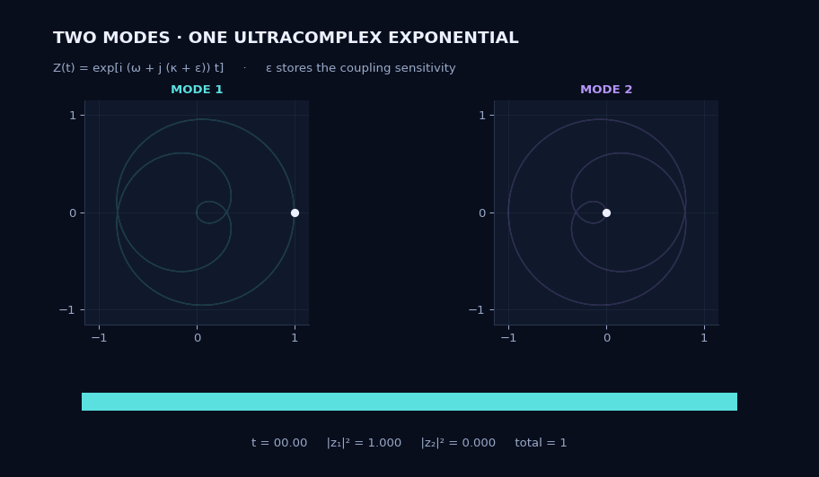
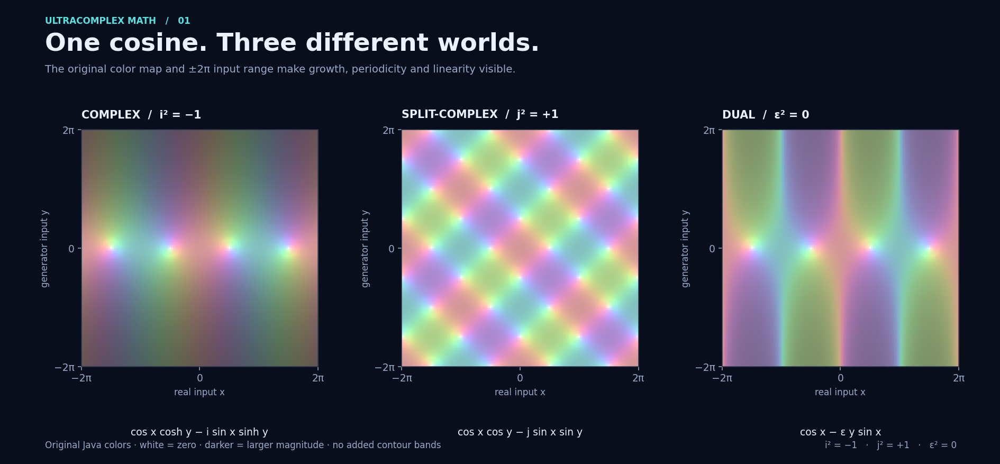

# Ultracomplex Math

A typed Python library for the eight-dimensional **commutative** real algebra

$$i^2=-1,\qquad j^2=1,\qquad \varepsilon^2=0.$$

Modernized from [Philipp Kolodziej's Java project](https://github.com/hoechp/ultracomplexmath).
The original multiplication and basis order are retained; numerical algorithms,
value semantics, parsers, project tooling and the desktop UI have been redesigned.

**Version 0.2.0:** all implemented Java feature areas have Python replacements,
including geometry, mechanisms, knowledge discovery and interactive visuals.
All **74 Java source files** and the remaining repository files are accounted for
in the [inventory](docs/inventory.md). The [migration guide](docs/migration.md)
records API mappings and intentional differences. This is a functional migration,
not a Java API compatibility layer or a pixel-identical Swing port.

## Visual laboratory



**[Explore the complete gallery](docs/gallery/README.md)**: cosine color maps,
Euler curves, hypercomplex angle surfaces, all eight coefficient traces and
a Newton fractal with **nine roots of a cubic**. The coupled-mode experiment
uses one ultracomplex exponential for two complex states and their parameter
sensitivities.

**[Three new applications](docs/gallery/applications.md):** travelling waves and
their speed sensitivity, a robot arm that follows a prescribed curve, and
reconstruction of a source separation from noisy interference measurements.
The examples evaluate the migrated `Ultra` arithmetic and use its derivatives
in the numerical solvers.


[Download the interactive offline lab](https://raw.githubusercontent.com/hoechp/temp/master/docs/gallery/lab.html)
and open the saved HTML file in a browser. Its sliders explore time, coupling
and the accuracy of a derivative-based prediction. All data comes from the
migrated Python engine.



Rebuild the figures and interactive lab with
`python examples/gallery.py` and `python -m examples.applications` after
installing `.[plot]`.
The [gallery notes](docs/gallery/README.md) explain the equations, color keys,
projections and independent verification.

## Install and calculate

Python 3.12+. The mathematical library has **no runtime dependencies**.
No PyPI release has been published; install from this repository:

```sh
python -m venv .venv
# Linux/macOS:
source .venv/bin/activate
# Windows PowerShell: .venv\Scripts\Activate.ps1
python -m pip install -e .
```

```python
from ultracomplexmath import Ultra, I, J, EPS, ONE, evaluate

assert I * I == -ONE
assert J * J == ONE
assert EPS * EPS == Ultra()

x = Ultra(1, 1, 1, -1)
assert x.inverse() == Ultra(0.25, 0.25, -0.25, 0.25)
assert x * x.inverse() == ONE
assert evaluate("exp(pi*i)").isclose(-ONE)
print((2 + EPS).sin())  # sin(2) + eps*cos(2)
```

Coefficient order: `(1, j, i, i*j, eps, eps*j, eps*i, eps*i*j)`.
Use `Ultra(real=2, i=3, eps=1)` for clarity. `Ultra.complex`, `.split` and `.dual`
embed the two-dimensional algebras. Independent closed types are also available:

```python
from ultracomplexmath import Binary, Complex, Dual

assert Binary(0, 1) ** 2 == Binary(1)
assert Dual(0, 1) ** 2 == Dual()
assert len(Binary(4).roots(2).values) == 4
assert Complex(-1).sqrt() == Complex(0, 1)
```

`Ultra`, `Complex`, `Binary` and `Dual` provide arithmetic, powers, exp/log/sqrt,
all six trigonometric and hyperbolic functions and their inverses.
Nonzero zero divisors are **not invertible**; division raises `NonInvertibleError`.
Domain failures raise explicit errors. Principal branches, conditioning and the
exact dual-function lift are specified in [mathematics.md](docs/mathematics.md).
Exact equality and approximate `.isclose(...)` are deliberately separate.

## Formulas and systems

```python
from ultracomplexmath import (
    BoundFormula,
    Calculation,
    Formula,
    FormulaSystem,
    solution_space,
    solve,
)

assert Formula("sin(x)^2 + cos(x)^2")({"x": 2 + EPS}).isclose(ONE)
assert Calculation("2î + 10_log(100)").result().isclose(2 + 2 * I)
f = BoundFormula("x²").set("x", 3)
assert f.result() == Ultra(9)
assert FormulaSystem("f=x²; x=sqrt(y); y=5").result().isclose(5)
assert solve([[0, 2], [1, 3]], [4, 7]) == (Ultra(1), Ultra(2))

family = solution_space([[EPS]], [EPS])
assert EPS * family.at(1, 2, 3, 4)[0] == EPS
```

`Formula` uses explicit multiplication and a restricted AST, with no `eval`/`exec`.
`Calculation` additionally accepts the original implicit multiplication, prefix
functions, superscripts, infix logarithms, `dot` and geometric word operators.
`SimpleCalculation` evaluates in one closed two-dimensional algebra.
`BoundFormula` provides live shared parameters; `FormulaSystem` resolves named
assignments. Missing variables and dependency cycles raise `ExpressionError`.

```sh
python -m ultracomplexmath 'exp(pi*i)'
ultracomplex '2î + 10_log(100)' --legacy --json
```

## Additional modules

| Module | Features |
| --- | --- |
| `numbers`, `coordinates` | Closed algebras, roots and branches, polar/Cartesian and hyperbolic forms, projections, sphere map |
| `geometry`, `matrix` | Vectors, frames, lines, dual angles, real matrices, canonicalizing `M2R` experiment |
| `mechanisms` | Joints, hierarchical mechanisms, axis mode, actors and scalar freedoms |
| `linalg`, `polynomial` | Square solves, complete affine solution spaces over real parameters, Newton interpolation and next-value guessing |
| `number_theory`, `modular` | Integer roots, primality, Fermat factors, extended Euclid, textbook RSA, residue orbits and ring tables |
| `clustering` | k-means, DBSCAN, hierarchical, grid and subspace clustering, silhouette, seeded data generation |
| `classification`, `rules`, `concepts` | Conditional probabilities, Apriori, association rules, property/term hierarchies and reduction |

Run `python examples/discovery.py` for the migrated rule, concept, modular and
number-theory demonstrations. The RSA functions reproduce a textbook arithmetic
exercise; they do not implement a padded encryption protocol.

## Interactive desktop explorers

```sh
python -m pip install -e '.[plot]'
ultracomplex-gui
ultracomplex-gui --view domain --formula 'cos(x)'
ultracomplex-gui --view domain-clusters --formula 'sin(x)'
ultracomplex-gui --view clustering
ultracomplex-gui --view mechanism
# Render without a graphical display:
ultracomplex-gui --view paths --output euler.png
```

The formula window offers all eight component traces, parametric paths, complex/
split/dual domain coloring, vector fields and four-dimensional domain clustering.
Edit the formula, range and view bounds; change `t` or animate it. Click the domain
or use arrows/WASD to move its probe. The toolbar provides pan, zoom and saving.
Clustering offers all five methods and data regeneration. The mechanism window
has shoulder, elevation and elbow controls.

`visuals.domain_color_grid` also supports arbitrary Ultra input planes, selected
output components and the two historical grid overlays. See the
[examples and UI details](docs/migration.md#visuals-and-demonstrations).

## Development and verification

```sh
python -m pip install -r requirements-dev.lock -r requirements-plot.lock
python -m pip install --no-build-isolation -e .
python -m pytest
python -m ruff check .
python -m ruff format --check .
python -m mypy
python tools/check_migration.py
python -m build --no-isolation
```

Alternatively: `uv sync --frozen --extra dev --extra plot`, then prefix commands
with `uv run`. CI checks Python 3.12, 3.13 and 3.14, including graphical callbacks
under a headless backend and an installed-wheel smoke test.

Tests cover all 64 basis products, property-based algebra identities, independent
complex and derivative oracles, all migrated feature families and deterministic
legacy regressions. Java fixture reproduction and inventory validation:

```sh
python tools/legacy_probe.py ../legacy-ultracomplexmath
python tools/legacy_extended_probe.py ../legacy-ultracomplexmath
python tools/check_migration.py ../legacy-ultracomplexmath
python tools/benchmark.py --iterations 1000
```

See [CONTRIBUTING.md](CONTRIBUTING.md) and [the audit](docs/audit.md).

## License

[0BSD (Zero-Clause BSD)](LICENSE), selected by the original author. Use, modify
and redistribute for any purpose, including commercially, with no attribution
or source-disclosure condition.
