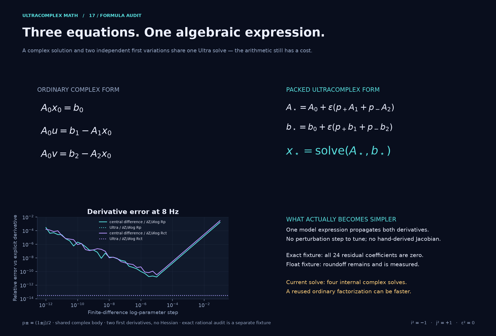

# Formula compression with values and two sensitivities

[Documentation](README.md) · [Engineering showcase](gallery/impact.md) · [Exact arithmetic](exact-arithmetic.md)

The useful simplification is **write the physical model once and propagate its first variations through the same expression**. It does not remove the underlying equations or promise faster execution. Dual numbers and forward automatic differentiation already provide this principle; the split structure supplies two independent complex-dual channels inside one `Ultra` value.

## From three equations to one solve

Let \(A_0\) be an invertible complex matrix, and let \(A_1,A_2,b_1,b_2\) be its matrix/RHS variations in two real parameter directions. Ordinary complex arithmetic gives

\[
A_0x_0=b_0,\qquad A_0u=b_1-A_1x_0,\qquad A_0v=b_2-A_2x_0.
\]

The idempotents \(p_\pm=(1\pm j)/2\) obey \(p_+p_-=0\), \(p_++p_-=1\). Define

\[
A_\star=A_0+\varepsilon(p_+A_1+p_-A_2),\qquad
b_\star=b_0+\varepsilon(p_+b_1+p_-b_2).
\]

Then one expression suffices:

\[
\boxed{x_\star=\operatorname{solve}(A_\star,b_\star)
=x_0+\varepsilon(p_+u+p_-v).}
\]

Multiplication and comparison of the coefficients of 1, \(\varepsilon p_+\) and \(\varepsilon p_-\) gives precisely the three ordinary equations above. This is an algebraic identity whenever the body matrix is invertible. It is not established merely by a numerical example.

### A self-contained executable example

Here a two-node complex system has one real conductance parameter in each diagonal. Seeding the parameters while constructing `A` avoids constructing derivative matrices by hand in application code.

```python
from ultracomplexmath import I, J, EPS, ONE, ZERO, solve

plus, minus = (ONE + J) / 2, (ONE - J) / 2
g1 = 2 * (ONE + EPS * plus)  # derivative with respect to log(g1)
g2 = 3 * (ONE + EPS * minus)  # derivative with respect to log(g2)
A = ((g1 + ONE + I, -ONE), (-ONE, g2 + ONE + 2 * I))
values = solve(A, (ONE, ZERO))
(voltage, d_log_g1), (same_voltage, d_log_g2) = values[0].channels()
assert voltage == same_voltage

# Independent two-by-two complex inverse and explicit derivatives:
a, d = 3 + 1j, 4 + 2j
determinant = a * d - 1
assert abs(voltage - d / determinant) < 1e-14
assert abs(d_log_g1 - (-2 * d * d / determinant**2)) < 1e-14
assert abs(d_log_g2 - (-3 / determinant**2)) < 1e-14
```

The [protective-coating demo](gallery/impact.md#2-impedance-diagnostics-identify-the-parameters-not-just-a-curve) uses this pattern in a three-node Kirchhoff system and passes both derivatives directly to an inverse fit. Log seeds preserve positive parameters during fitting and make derivative scales interpretable: \(\partial Z/\partial\log R=R\,\partial Z/\partial R\).

## Exactness has a precise meaning

For rational coefficients, the same identity holds without floating-point rounding:

```python
from ultracomplexmath import QI, QJ, QEPS, QONE, QZERO, ExactMatrix

plus, minus = (QONE + QJ) / 2, (QONE - QJ) / 2
A = ExactMatrix(
    (
        (2 * (QONE + QEPS * plus) + QONE + QI, -QONE),
        (-QONE, 3 * (QONE + QEPS * minus) + QONE + 2 * QI),
    )
)
b = (QONE, QZERO)
x = A.solve(b)
assert A.apply(x) == b  # all coefficients, exact Fraction arithmetic
```

`ExactMatrix` uses rational arithmetic; it does not turn measured parameters into exact knowledge. The showcase's larger rational fixture is independent of its synthetic noisy data. At 8 Hz in the floating fixture, both Ultra impedance derivatives agree with separately derived formulas to roughly \(3.2\times10^{-14}\) relative. At higher frequencies, a tiny channel derivative loses relative digits beside a much larger channel. The report records that loss instead of hiding it inside a body-dominated norm.



Epsilon is a nilpotent algebra element, not a tiny floating perturbation. Therefore there is no finite-difference step to tune. This removes finite-difference truncation and subtraction errors, but leaves ordinary floating arithmetic errors inside the evaluation.

## A second compact identity: layered projective transformations

For fixed scalar coefficients and \(T(z)=(az+b)/(cz+d)\),

\[
T(z+\varepsilon w)
=T(z)+\varepsilon\frac{(ad-bc)w}{(cz+d)^2},
\]

provided the denominator is invertible. If \(ad-bc=1\), the transported tangent is simply \(w/(cz+d)^2\). Ordered composition then propagates state and tangent together; manually nesting all quotient and chain rules is unnecessary.

```python
from ultracomplexmath import EPS, ONE, Ultra, Mobius

transform = Mobius(2 * ONE, ONE, ONE, ONE)  # determinant 1
z = Ultra(real=0.3, i=0.4)
w = Ultra(real=0.7, i=-0.2)
packed = transform(z + EPS * w)
assert packed.primal.isclose(transform(z))
assert packed.tangent.isclose(w / (z + ONE) ** 2)
```

The optical demo additionally places epsilon in the **layer coefficients**, so its derivative includes their variation too. The fixed-coefficient identity above alone would miss those terms. Its homogeneous representation delays affine division, but physical reflection/transmission still require their own nonsingular denominators.

## Where this helps, and where it does not

| Question | Answer |
| --- | --- |
| What becomes shorter? | The model expression and derivative bookkeeping: one construction feeds values and two first variations |
| What does `j` contribute here? | Two orthogonal complex-dual channels; this encoding is mathematically equivalent to an explicit pair |
| Is there more geometry than batching? | In the damping example, noncommuting operators retain a Jordan part across circular/parabolic/hyperbolic regimes; the choice of action and invariant is additional structure |
| Is it faster than ordinary linear algebra? | Not established. Current `solve` performs four complex solves, including two identical body solves here. Reusing an ordinary factorization can be faster |
| Does it give a Hessian? | No. All products of these epsilon directions vanish; second and mixed parameter derivatives are not stored |
| Can both channels also represent different polarizations? | Yes, but then each channel has its own body and one derivative; it no longer provides two derivatives of the same body |
| Does it fix a singular model? | No. Singular body systems have no unique inverse; numerical singularity checks remain active |
| Is it a replacement for spatial coordinates? | No. Spatial/time locations remain external, as in `UltraField` |

For the oscillator, the critical nilpotent **operator** and the epsilon **coefficient** remain separate. Their product must survive; identifying them would remove real sensitivity terms. See the [damping derivation](gallery/impact.md#3-vibration-settling-through-critical-damping) and the [independent-direction roadmap](research/roadmap.md).

The payoff is a consistent algebra in which composable physical models carry their differential information and exact invariants. Any stronger advantage needs a benchmark with the same outputs, precision and model assumptions.
