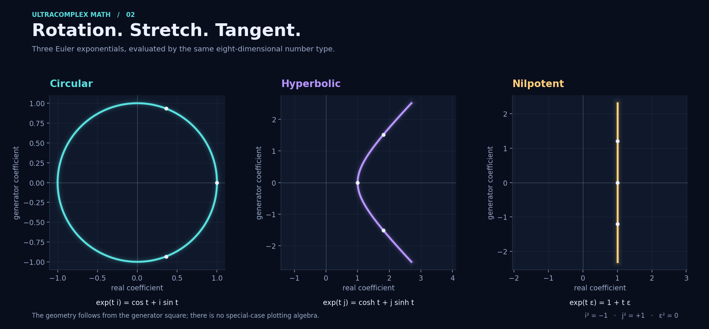
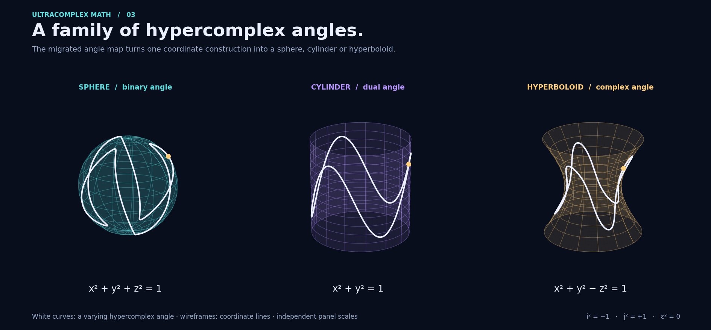
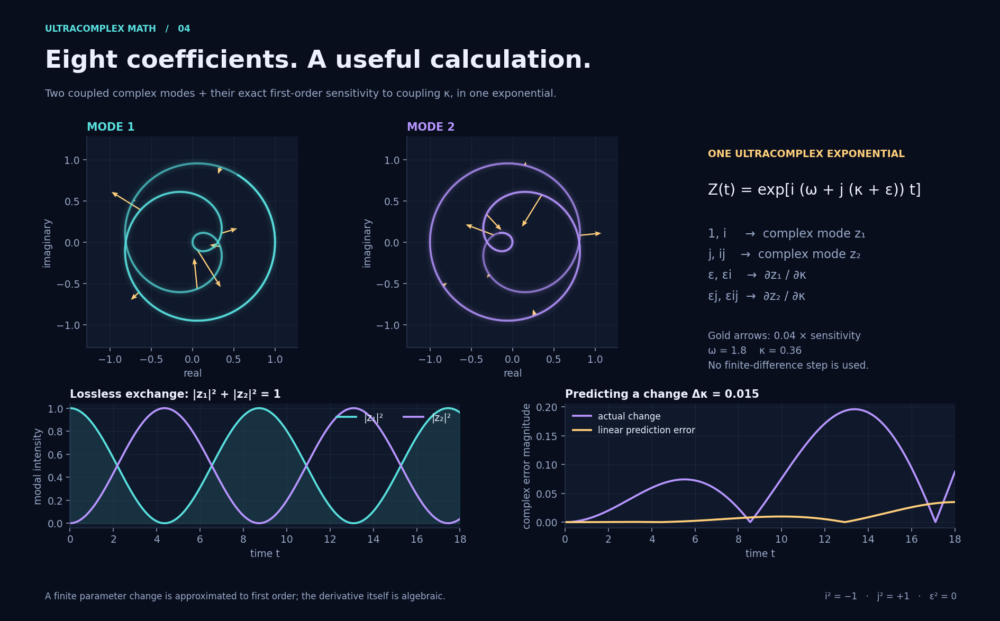
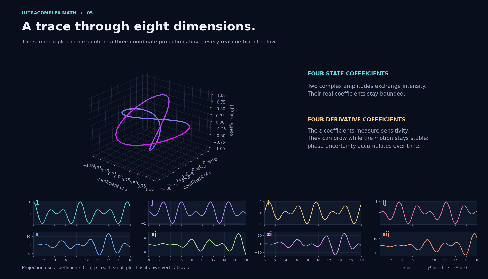
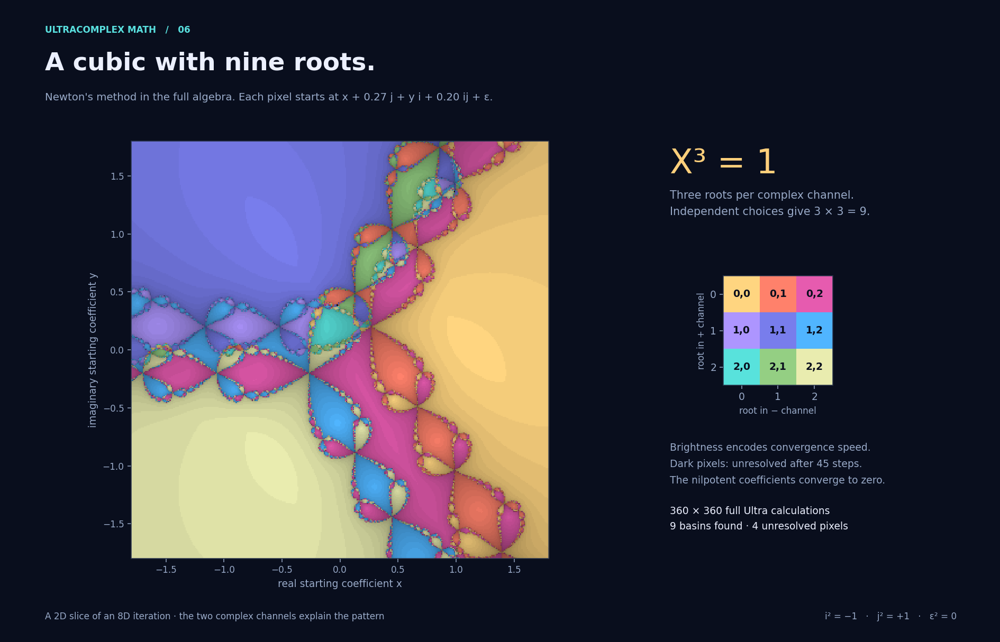

# Ultracomplex visual laboratory

Six reproducible figures, an animation and an offline interactive experiment,
computed with the migrated Python library. The cosine maps and Euler curves
revisit the original Java README; the angle surfaces, full-algebra Newton
basins and sensitivity experiment develop those ideas further.


**[Download the standalone interactive lab](https://raw.githubusercontent.com/hoechp/temp/master/docs/gallery/lab.html)**
and open the saved HTML file in a browser. It works offline, including its data,
sliders and animation. GitHub's normal file view displays source rather than
executing the page. The lab can also be opened from a local checkout at
`docs/gallery/lab.html`.

## Reproduce everything

From the repository root, with Python 3.12+:

```sh
python -m pip install -e '.[plot]'
python examples/gallery.py
# Faster preview in a separate directory:
python examples/gallery.py --quick --output /tmp/ultra-gallery
# Rebuild one demonstration:
python examples/gallery.py --only coupling
python examples/gallery.py --only newton
```

The normal render evaluates 360 × 360 samples per domain image. The Newton
image can take several minutes because **every pixel runs the actual `Ultra`
arithmetic**, including its nilpotent coefficients. `--quick` reduces sampling.
The lab stores 21 coupling values and 241 time samples computed by `Ultra.exp()`;
JavaScript only draws the data and forms the first-order prediction. No CDN,
server, external font or alternative algebra implementation is required.

For the project's pinned Python packages, use `requirements-plot.lock` or
`uv sync --frozen --extra plot`. The core remains dependency-free. NumPy,
Matplotlib and Pillow are used by this optional example to arrange data and
render graphics. Pixel appearance can differ between plotting-library versions.

## 1. The cosine atlas


For the same real inputs x and y:

| Input | Output |
| --- | --- |
| x + iy | cos(x) cosh(y) − i sin(x) sinh(y) |
| x + jy | cos(x) cos(y) − j sin(x) sin(y) |
| x + εy | cos(x) − εy sin(x) |

Every pixel calls the migrated `Ultra.cos()`. All panels use the same color
encoding: hue is the **Euclidean direction of the two output coefficients**,
computed with `atan2`; brightness depends on their Euclidean magnitude. Subtle
bands show magnitude and angular levels. This display angle is not a claim
that split-complex or dual numbers have an ordinary complex argument or a
multiplicative Euclidean norm.

## 2. Three Euler geometries



`(t * unit).exp()` gives a circle for `I`, one branch of a hyperbola for `J`,
and a straight line for `EPS`:

$$e^{it}=\cos t+i\sin t,\qquad
  e^{jt}=\cosh t+j\sinh t,\qquad
  e^{\varepsilon t}=1+\varepsilon t.$$

These are separate embedded subalgebras inside the same eight-dimensional type.

## 3. Hypercomplex angles become surfaces



The original angle construction, now `geometry.vector_from_angle`, maps
`a + u*b` to `(r(b) cos(a), r(b) sin(a), z(b))`:

| Angle type | r(b) | z(b) | Result |
| --- | --- | --- | --- |
| `Binary`, u² = +1 | cos(b) | sin(b) | x² + y² + z² = 1 |
| `Dual`, u² = 0 | 1 | b | x² + y² = 1 |
| `Complex`, u² = −1 | cosh(b) | sinh(b) | x² + y² − z² = 1 |

This is a useful unified parameterization. It uses a different construction
from the Euler curves above, so the pairing of an algebra with a surface is
different. The white paths vary both angle coordinates. Surface panels use
independent display scales. These coordinates do not, by themselves, supply
a general composition law for arbitrary 3D rotations.

## 4. A concrete use for all eight coefficients



Consider an ideal, lossless pair of coupled complex modes:

$$\dot z_1=i\omega z_1+i\kappa z_2,\qquad
  \dot z_2=i\kappa z_1+i\omega z_2,\qquad (z_1(0),z_2(0))=(1,0).$$

Package the modes as `Z = z1 + j*z2` and seed the coupling as `κ + ε`:

```python
from ultracomplexmath import I, J, EPS

omega, coupling, t = 1.8, 0.36, 5.0
Z = (t * I * (omega + J * (coupling + EPS))).exp()

z1 = complex(Z.real, Z.i)
z2 = complex(Z.j, Z.ij)
dz1_dk = complex(Z.eps, Z.eps_i)
dz2_dk = complex(Z.eps_j, Z.eps_ij)
```

The same exponential returns two complex states **and** both complex derivatives
with respect to κ. Differentiation is exact in the algebra, subject to ordinary
floating-point rounding. It does not choose a finite-difference step.

An independent reference is

$$z_1=e^{i\omega t}\cos(\kappa t),\qquad
  z_2=i e^{i\omega t}\sin(\kappa t).$$

It implies `|z1|² + |z2|² = 1`. The ε coefficients agree with the derivatives
of these formulas. A finite change is only approximated:

$$z(\kappa+\Delta\kappa)
  =z(\kappa)+\Delta\kappa\,\partial_\kappa z+O(\Delta\kappa^2).$$

The static chart compares the actual change with the prediction error for
mode 1; the interactive lab reports the Euclidean error over both modes.
The gold arrows in the static phase portraits show `0.04 * ∂z/∂κ`; the bottom
comparison uses the separately labelled `Δκ = 0.015`.



This demonstrates a compact representation for a symmetric linear system and
forward-mode automatic differentiation. It does not establish a computational
advantage over specialized complex-array code. The projection is labelled by
its three selected coefficients; the small plots expose all eight coefficients.
Derivative growth records accumulating phase sensitivity, not energy growth.
The 2D animation displays the two state modes; their derivatives are explored
in the static chart and interactive lab.

## 5. Why a cubic has nine roots here



Every pixel iterates the full eight-component equation

$$X_{n+1}=X_n-\frac{X_n^3-1}{3X_n^2}$$

from `X0 = x + 0.27*j + y*i + 0.20*i*j + eps`. The residual threshold is
`||X³ − 1||₂ < 10⁻⁹`, including all nilpotent coefficients, with at most
45 updates. Noninvertible derivatives, numerical failures and unresolved
starts are dark. Brighter pixels reach the residual threshold sooner.

The explanation is the exact channel decomposition

$$p_\pm=(1\pm j)/2,\qquad
  X=(z_++\varepsilon w_+)p_++(z_-+\varepsilon w_-)p_-.$$

`X³ = 1` requires each complex body `z±` to be a cube root of unity. Since
`3*z±²` is nonzero, both nilpotent parts must be zero. Thus there are exactly
`3 × 3 = 9` roots, indexed by the two channel choices in the legend. Their
explicit construction in the library is:

```python
from cmath import exp, pi
from ultracomplexmath import Ultra, ONE

roots = [
    Ultra.from_channels((exp(2j * pi * a / 3), 0), (exp(2j * pi * b / 3), 0))
    for a in range(3)
    for b in range(3)
]
assert all((root**3).isclose(ONE) for root in roots)
```

The image is a two-dimensional slice through an eight-dimensional iteration.
Its structure follows from the two complex Newton maps; it is not evidence
of a newly discovered class of fractals. This algebra has zero divisors, so
the familiar field restriction on the number of roots of a polynomial does
not apply.

## Verification and source

- [Renderer and all numerical sampling](../../examples/gallery.py)
- [HTML template](../../examples/gallery_lab.html)
- [Independent mathematical tests](../../tests/test_gallery.py)
- [Numerical verification from the full render](verification.json)

`verify_math()` checks the closed-form solution and derivatives, intensity
conservation, all nine root residuals, and the second-order remainder of the
linear prediction. The tests also check all three cosine identities, the
three implicit surface equations, Newton convergence with nonzero nilpotent
seeds and explicit treatment of a singular derivative.
