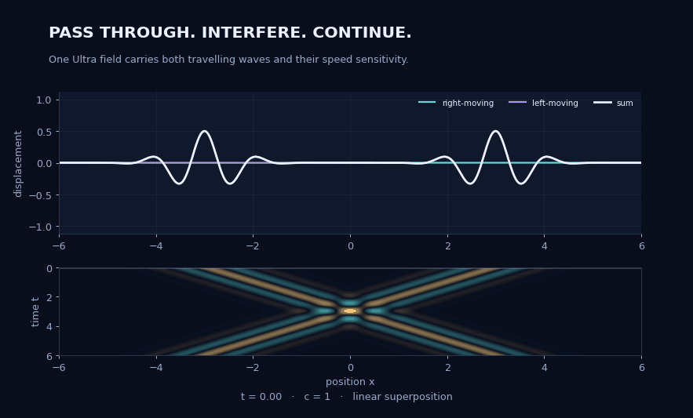
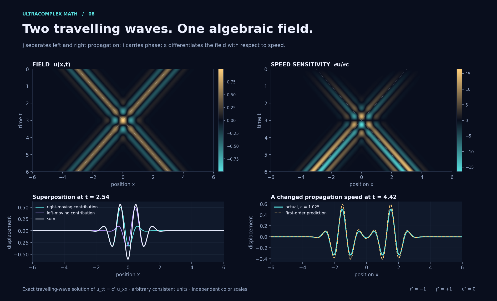
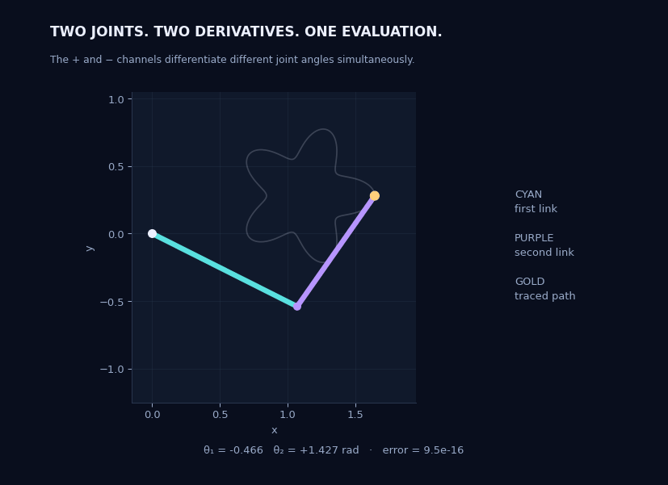
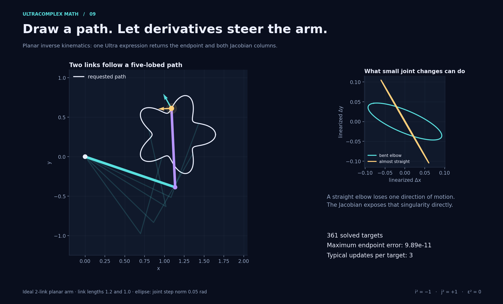
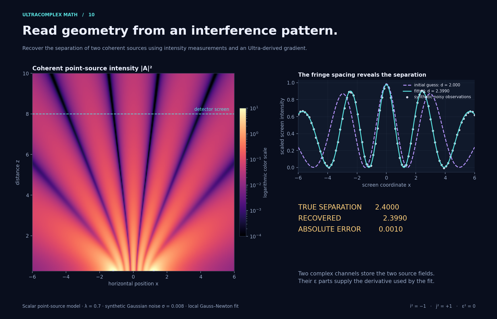

# Three applications of ultracomplex arithmetic

[Showcase](README.md) · [Documentation](../README.md) · [Next applications](../research/applications.md)

These implemented examples combine complex phase/geometry, split directions or independent seeds, and dual first variations. Their physical roles differ: opposing propagation in the wave model, separate Jacobian seeds in robotics, and paired sources in interference. The shared algebra retains their mixed terms throughout the computation.

| Application | C | S | D | Result |
| --- | --- | --- | --- | --- |
| Travelling waves | Carrier phase | Opposite characteristics | Speed derivative | Field and propagation sensitivity |
| Planar robot | Rotation and endpoint | Separate parameter seeds | Jacobian columns | Tracking a prescribed curve |
| Interference | Propagation phase | Paired source locations | Separation derivative | Recovering geometry from intensity |

Split eigenspaces are useful computational coordinates: `p±=(1±j)/2` and `X=(z+ + eps*w+)p+ + (z- + eps*w-)p-`. This representation supports these particular models without limiting the full union to one interpretation. NumPy handles sample arrays/real least-squares updates; Matplotlib and Pillow render.

## Travelling waves and sensitivity to speed



Let `F(s) = exp(−s²/σ² + i k s)`. One expression packages two opposing
Gaussian wave packets:

$$Q=x-j\bigl((c+\varepsilon)t-a\bigr),\qquad
W=\exp(-Q^2/\sigma^2+ikQ),$$

with `σ = 0.85`, `k = 5.5`, `a = 3` and `c = 1`. In Python:

```python
from ultracomplexmath import I, J, EPS

q = x - J * ((speed + EPS) * t - 3.0)
W = (-(q * q) / 0.85**2 + I * 5.5 * q).exp()
u = W.real
du_dc = W.eps
```

The complex body in the plus channel is `F(x − ct + a)`; the minus channel
is `F(x + ct − a)`. Their average has real part

$$u(x,t)=\tfrac12\Re\{F(x-ct+a)+F(x+ct-a)\},\qquad
u_{tt}=c^2u_{xx}.$$

The packets meet, interfere and pass through each other by linear
superposition. This is a sampled exact solution of the one-dimensional wave
equation on an unbounded line. It assumes constant speed and no damping or
dispersion. The animation shows each half-weighted contribution and their sum.



The ε coefficients give the speed derivatives of both complex packets. The
real ε coefficient is `∂u/∂c`; it predicts the change for `Δc = 0.025` through
`u(c + Δc) ≈ u(c) + Δc ∂u/∂c`. The derivative is exact up to floating-point
rounding; the finite-change prediction has a second-order remainder. Field and
derivative heat maps use separate color scales. All units are arbitrary and
consistent.

Here all eight real coefficients have a direct role: two complex travelling
waves and their two complex speed derivatives. This representation could be
useful when studying propagation sensitivity or fitting a propagation speed.

Background: MIT's [Waves II](https://ocw.mit.edu/ans7870/18/18.03/s06/tools/WavesIIHelp.html)
explains the right/left decomposition of the d'Alembert solution.

## A robot arm follows a prescribed curve



For a planar arm with link lengths `L₁ = 1.2` and `L₂ = 1.0`, the complex
endpoint is

$$P(\theta_1,\theta_2)
  =L_1e^{i\theta_1}+L_2e^{i(\theta_1+\theta_2)}.$$

Seed the angles differently in the two channels:

```python
from ultracomplexmath import I, J, EPS, ONE

p_plus, p_minus = (ONE + J) / 2, (ONE - J) / 2
a = theta1 + EPS * p_plus
b = theta2 + EPS * p_minus
P = 1.2 * (I * a).exp() + (I * (a + b)).exp()
(position, dP_dtheta1), (_, dP_dtheta2) = P.channels()
```

One evaluation gives the position and both columns of the real Jacobian `D`
of `(Re P, Im P)`. The body position is duplicated across channels, so six
independent real quantities are encoded here. Each target is solved using

$$(D^T D+10^{-8}I_2)\,\Delta\theta
  =D^T(\text{target}-\text{position}),$$

limiting each step to a norm of `0.3` radians and stopping below endpoint error
`10⁻¹⁰`. The previous joint configuration initializes the next target.



The full render solves **361 targets**, with maximum endpoint error
**9.89 × 10⁻¹¹** and a median of **3 updates** per target. These are numerical
errors in an ideal geometric model, not a prediction of hardware precision.
The cyan and gold arrows at the endpoint show the two Jacobian columns scaled
by `0.17`. The ellipses map a joint step circle of radius `0.05` radians through
the Jacobian. A straight elbow has rank one: instantaneous motion loses a
direction even though the endpoint can still move away from the singular
configuration through finite joint changes.

This demo uses the algebra to provide derivatives for a practical geometric
solver. Its scope is a planar two-link arm with unrestricted joints and no
collision or dynamics model.

Background: Lynch and Park's
[Modern Robotics, §6.2](https://modernrobotics.northwestern.edu/nu-gm-book-resource/6-2-numerical-inverse-kinematics-part-1-of-2/)
describes Jacobian-based iterative inverse kinematics and using the preceding
solution to initialize the next pose. The damping and step limit above are
the choices made in this example.

## Recover geometry from an interference pattern



Two coherent, equal-amplitude scalar point sources lie at `(±d/2, 0)`, with
known wavelength `λ = 0.7`. Their three-dimensional spherical propagators are
sampled in the `x,z` plane for `z > 0`:

$$R=\sqrt{(x-j(d+\varepsilon)/2)^2+z^2},\qquad
G=\frac{e^{i(2\pi/\lambda)R}}{R}.$$

The plus and minus channels contain the two fields and their separation
derivatives. Their sum is the complex amplitude

$$A=2(G_{1}+iG_i),\qquad
\partial_d A=2(G_\varepsilon+iG_{\varepsilon i}),\qquad
\partial_d|A|^2=2\Re(\overline A\,\partial_d A).$$

The last identity handles the non-holomorphic intensity explicitly: extract
the complex amplitude and its derivative before taking the squared magnitude.
The field image uses `|A|²` on a logarithmic color scale. The white triangles
on its lower edge indicate the source x positions; the sources themselves
are at `z = 0`, below the displayed `z ≥ 0.25` domain.

At the screen `z = 8`, the demo generates 81 synthetic measurements using an
independent scalar implementation, adds Gaussian noise with standard deviation
`0.008`, and fits only `d` using a local Gauss–Newton iteration with backtracking.
Screen intensity is scaled by `z²/4`; the noise level refers to that scale.

| Quantity | Full-render result |
| --- | --- |
| True separation | 2.4000 |
| Initial estimate | 2.0000 |
| Recovered separation | 2.3989603 |
| Absolute error | 0.0010397 |
| Relative error | 0.0433% |

The fit uses all eight coefficients as two complex source fields and their
derivatives. The example demonstrates parameter estimation from noisy
measurements with a known forward model. It assumes known wavelength,
equal source amplitudes and phases, and known screen distance. It is a local
fit for this dataset; different initial guesses or additional unknowns can
create ambiguities. The scalar point-source model omits polarization,
finite apertures, near-field electromagnetic effects and multiple scattering.

Background: the [Feynman Lectures, Volume I, Chapter 29](https://www.feynmanlectures.caltech.edu/I_29.html)
discuss superposition, propagation phase, the `1/r` field dependence and
intensity. The demo uses those scalar interference ingredients with the
stated point-source assumptions.

## Reproduce and check

From the repository root:

```sh
python -m pip install -e '.[plot]'
python -m examples.applications
python -m examples.applications --only interference
python -m examples.applications --quick --output /tmp/ultra-applications
python -m pytest tests/test_applications.py
```

- [Implementation and renderers](../../examples/applications.py)
- [Independent mathematical tests](../../tests/test_applications.py)
- [Full-render numerical report](applications-verification.json)

The tests compare wave channels, kinematics, Jacobians and interference
gradients with ordinary complex/scalar formulas. They also check the wave
equation numerically, robot singularity and complete path tracking, and
separation recovery with and without noise. The largest oracle discrepancies
in the render report are below `1.6 × 10⁻¹⁴`.

These examples show compact expressions and useful automatic derivatives.
They do not benchmark speed against specialized array code or claim that the
underlying wave, robotics or interference models are new. The practical
contribution here is their explicit implementation and verification through
the project's combined algebra. The checked-in figure report describes its full render dataset; current tests independently check the models.
