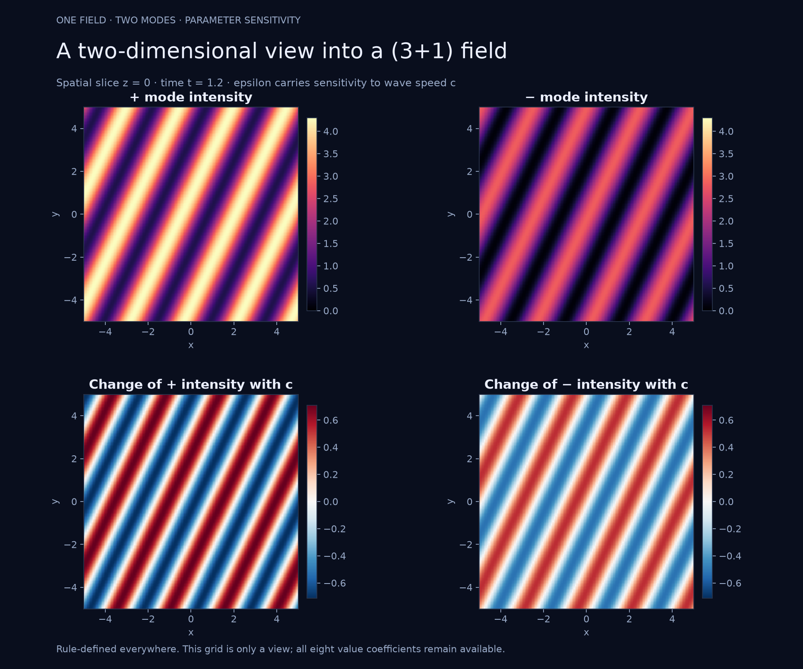
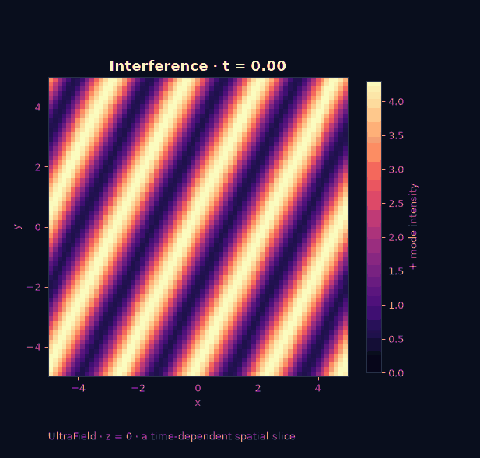
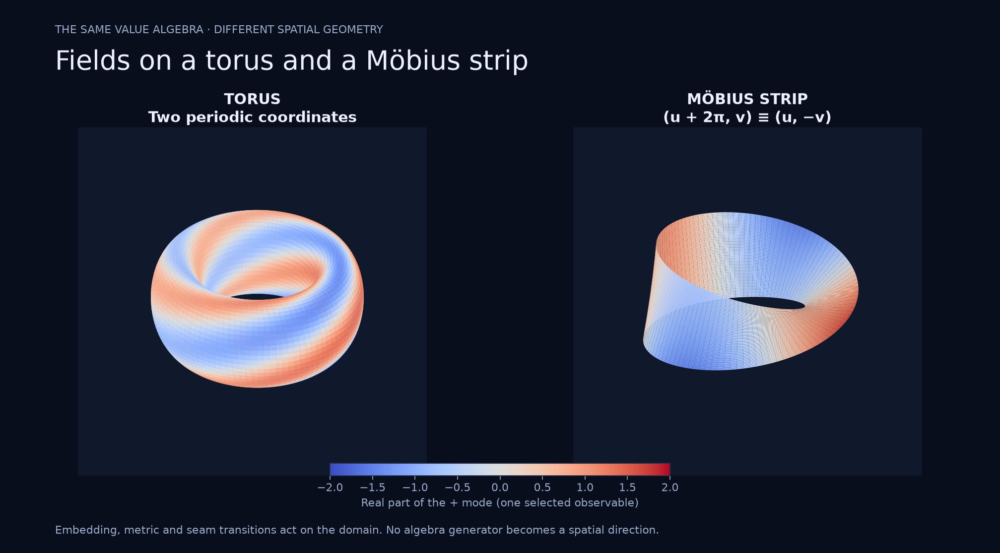

# UltraField showcase

[Field guide](../fields.md) · [Mathematical consequences](../research/fields.md) · [Showcase](README.md)

## A (3+1) field, seen through a two-dimensional slice



The rule is a superposition of two plane waves with wave vectors `(1.6, 0.6, 0.4)` and `(-0.9, 1.8, -0.5)`. Each frequency is `c*|k|`, with `c=1`. Constant split amplitudes and mixed phases make the two complex-dual channels visibly different. Epsilon seeds a change in the speed. Spatial coordinates are independent real inputs.

The top row shows `|z+|²` and `|z-|²`. The lower row shows their speed derivatives `2 Re(conj(z±) w±)`, using the existing derivative-preserving `Ultra.abs2()`. Both rows retain the same spatial coordinates; color is an explicitly selected observable, never an extra coordinate. Intensity shares one scale across channels, and both sensitivities share one symmetric scale.

The static view fixes `z=0, t=1.2` and samples 141 × 141 positions over `[-5,5]²`. Other slices are obtained by fixing different coordinates, including `x,t` for a `y,z` view or `y,z` for an `x,t` view.



The animation samples the same rule on a 65 × 65 grid at 16 times between 0 and 5. Its compact 480-pixel preview uses 32 display colors; numerical samples retain all eight full-precision coefficients. Playback loops for presentation; the final frame is not identified with the initial time. A sample grid is a display of the continuous rule, not its definition.

## Values on curved and nonorientable surfaces



The torus uses `R=2, r=0.65` and

$$F=\exp(i(2u-3v-t)+0.3j\cos u+0.45ij\sin v)
(1+0.2\varepsilon\cos(u+v)).$$

Both parameters are periodic. The Möbius strip has radius `2`, half-width `0.6` and

$$F=\exp(i(2u-t)+0.8jv\cos(u/2))\bigl(1+\varepsilon v\sin(u/2)\bigr).$$

This formula respects `(u+2π,v) ~ (u,-v)` in every coefficient. Colors show the real part of the plus-channel body at `t=0`, with a shared `[-2,2]` color scale. They are not the full value: the other components remain accessible through the same field. Each surface uses 113 × 57 parameter samples. The real embedding controls the displayed location; its Jacobian controls the implemented metric, surface gradient, area integral and Laplace–Beltrami operator.

The examples are specified mathematical models, not models of gravitational dilation or particle spin. Neither figure establishes a new physical interpretation.

## Reproduce and inspect

```sh
python -m pip install -e '.[plot]'
python -m examples.fields --animate
# Faster previews in a separate directory:
python -m examples.fields --quick --animate --output /tmp/ultrafield-preview
python -m pytest tests/test_fields.py tests/test_surfaces.py
```

The [generator](../../examples/fields.py) uses the shipped `UltraField`, view, sampling and surface APIs. Matplotlib renders the data; NumPy arranges arrays. There is no duplicated hypercomplex implementation in the plotting code. The [render report](assets/ultrafield-report.json) records formulas, grids, seam diagnostics and torus-area error. Finite seam checks complement the algebraic transition argument; they do not prove it for every point.
