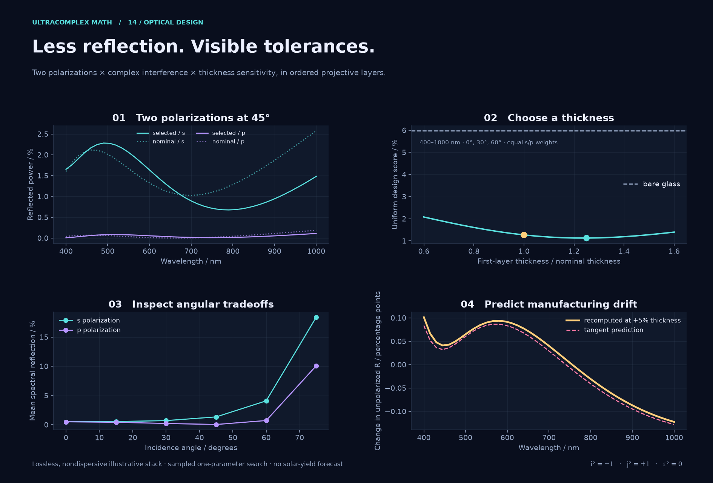
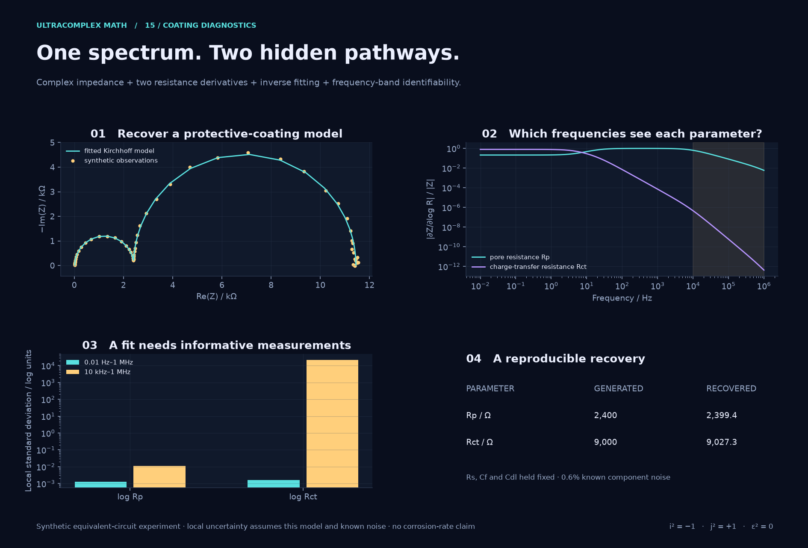
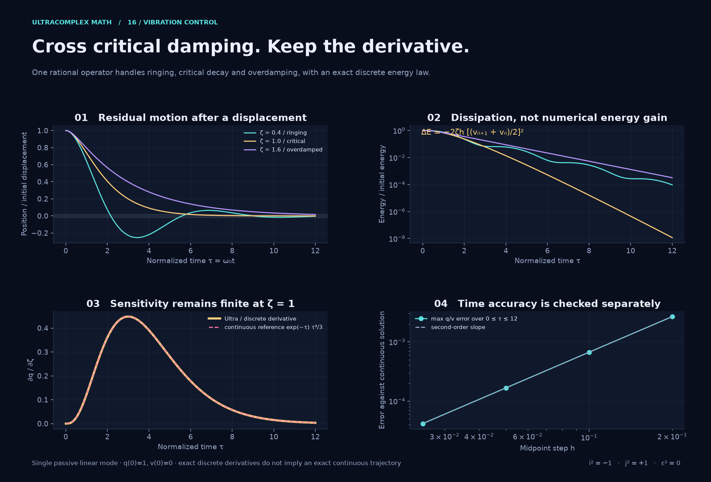

# Engineering showcase: three things that belong together

[Showcase](README.md) · [Interactive lab](impact-lab.html) · [Formula compression](../formula-compression.md) · [API map](../api.md)

These examples bring **physical response, parameter sensitivity and a checkable structure** into the same computation. They use existing APIs that the earlier wave, robot and interference demos did not explore in depth: projective layer composition, complex linear solves with exact audits, and noncommuting Cayley operators across critical damping.

| Application and decision | What is combined | Existing APIs doing the work |
| --- | --- | --- |
| Antireflection coatings: choose a thickness and assess manufacturing drift | Interference, s/p polarization, ordered layers and a thickness derivative | `Mobius`, `ProjectivePoint`, `Ultra.sin/cos`, `.abs2()` |
| Protective-coating diagnostics: infer two resistances and choose useful frequencies | Kirchhoff equations, complex measurements, two derivatives, fitting and local uncertainty | `solve`, `.channels()`, `ExactMatrix.solve` |
| Vibration settling: change damping without losing the critical case | Oscillatory, critical and overdamped motion; sensitivity; rational energy balance | `ModeOperator.from_matrix`, `.cayley`, `ExactUltra` |

The practical settings are established. The numbers below come from specified, reproducible models, **not measured devices**. The benefit demonstrated here is composable expressions and auditable derivatives/invariants. Ordinary complex matrices and automatic differentiation can express these models too; this is not evidence of unique physical capability or superior runtime.

## Explore the lab

[Download the standalone HTML](https://raw.githubusercontent.com/hoechp/temp/master/docs/gallery/impact-lab.html) and open the saved file locally. GitHub displays HTML source rather than executing it. The four tabs offer:

1. Thickness and angle controls, plus a first-order prediction checked against the adjacent computed thickness.
2. A frequency cursor and a full-band/high-band information comparison.
3. A damping control that passes directly through the critical case.
4. A finite-difference step sweep beside the packed derivative result.

The file works offline. Controls select samples computed by the Python models; JavaScript draws them and forms explicitly labeled first-order predictions. Display values are rounded to seven significant digits. Full-precision evidence is in the [render report](assets/impact-report.json).

## 1. Antireflection coatings with manufacturing tolerances



**Why this matters.** Front-surface reflection is relevant to optical transmission and solar-module cover glass. A useful coating must work over wavelengths and angles, and survive departures from its nominal thickness. The demo asks how those considerations interact in a deliberately small design problem.

### Model and result

Air illuminates two isotropic layers on a semi-infinite glass substrate. Refractive indices are real and nondispersive:

| Medium | Index | Nominal thickness |
| --- | --- | --- |
| Incident air | 1 | — |
| First layer | 1.22 | 112.704918 nm |
| Second layer | 1.38 | 99.637681 nm |
| Glass substrate | 1.52 | semi-infinite |

Only the first layer's thickness varies, by a factor `scale` from 0.6 to 1.6 in 21 samples. The design score is the arithmetic mean of reflectance at **41 wavelengths from 400 to 1000 nm**, **angles 0°, 30°, 60°**, and **equal s/p polarization weights**. It is not a solar-spectrum integral.

| Design | Mean reflected power under that score |
| --- | --- |
| Bare glass | 5.97354% |
| Nominal two-layer stack | 1.26981% |
| Lowest sampled score: first layer ×1.25 | 1.12743% |

The selected change reduces the nominal score by about **11.2% relative**, or **0.1424 percentage points**. This is a bounded one-parameter grid search, not a global optimum. The angle plot also includes 75°, which is outside the scoring angles and exposes a substantial tradeoff.

### Why the algebra fits

Let \(p_\pm=(1\pm j)/2\). The plus channel holds s polarization, the minus channel p polarization. With conserved transverse wavevector and real layer angle \(\theta_n\), pack the tangential-field admittances as

\[
q=n\cos\theta_n\,p_+ + \frac{n}{\cos\theta_n}\,p_-.
\]

For phase \(\delta=2\pi n d\cos\theta_n/\lambda\), each layer acts on homogeneous coordinates \([H:E]\):

\[
M=\begin{pmatrix}\cos\delta&i q\sin\delta\\i\sin\delta/q&\cos\delta\end{pmatrix},
\qquad \det M=1.
\]

The time convention is \(e^{+i\omega t}\). The incident-to-substrate order is `M1 @ M2`; reversing layers changes the response. `Mobius` is an **operator** with noncommuting composition even though its scalar coefficients commute. `ProjectivePoint` carries the final field ratio without prematurely dividing by a potentially poor affine coordinate.

Substitute \(d_1=d_{1,0}(s+\varepsilon)\). The same chain gives reflection, transmission and their derivative with respect to **dimensionless scale** \(s\). Power uses `.abs2()`, not the Euclidean eight-coefficient `abs()` norm. A +5% thickness change is therefore predicted with \(\Delta s=0.05s\), not a fixed 0.05 at every setting.

**Checks.** An independent ordinary-complex Fresnel recursion agrees with complex reflection amplitudes to below \(9\times10^{-16}\) over the displayed grid. The maximum coefficient residual in \(R+T=1\), including its derivative, is below \(1.4\times10^{-15}\). Tests also cover the single-layer quarter-wave zero, bare glass, layer order and quadratic scaling of the first-order prediction error. At the selected design, the +5% prediction differs from recomputation by at most **0.01794 percentage points** of reflectance at 45°.

**Scope.** There is no absorption, dispersion, roughness, scattering, rear-surface reflection or temperature dependence. Long or strongly attenuating stacks need a conditioned scattering formulation; homogeneous coordinates alone do not cure matrix overflow. Indices are illustrative, not a materials prescription. See [Byrnes' multilayer derivation](https://arxiv.org/abs/1603.02720) and [Karin, Miller and Jain's PV-coating study](https://arxiv.org/abs/2101.05446) for the physical context; their experimental data are not used here.

## 2. Impedance diagnostics: identify the parameters, not just a curve



**Why this matters.** Impedance spectroscopy can probe the behavior of protective coatings without removing them. A convincing curve fit is insufficient if the chosen frequencies cannot distinguish the parameters. The example makes that distinction visible.

Use the equivalent circuit

\[
Z=R_s+\left[C_f\parallel\left(R_p+(R_{ct}\parallel C_{dl})\right)\right],
\]

where a capacitor means its impedance \(1/(i\omega C)\). `circuit_system` constructs a **three-node Kirchhoff matrix**, with a unit test current at the input; the input voltage is then the impedance. The unit current is a linear normalization, not a suggested experimental excitation.

| Generating parameter | Value | In the fit |
| --- | --- | --- |
| Series resistance \(R_s\) | 20 Ω | fixed |
| Pore resistance \(R_p\) | 2,400 Ω | inferred |
| Charge-transfer resistance \(R_{ct}\) | 9,000 Ω | inferred |
| Coating capacitance \(C_f\) | 8 nF | fixed |
| Double-layer capacitance \(C_{dl}\) | 4 µF | fixed |

The model seeds \(R_p(1+\varepsilon p_+)\) and \(R_{ct}(1+\varepsilon p_-)\). `solve(A,b)` produces the same complex impedance in both bodies and **two different log-resistance derivatives** in their tangents. A damped Gauss–Newton fit uses these derivatives; its least-squares step is solved by NumPy's SVD-based `lstsq`.

### Reproducible recovery and an uninformative band

Generate 65 frequencies from 0.01 Hz to 1 MHz using an independent series/parallel formula. Add independent Gaussian noise to each real and imaginary observation, with known standard deviation \(0.006|Z_{true}|\), seed 2317. Starting from 1,200 Ω and 5,000 Ω, the fit recovers:

| Parameter | Recovered | Relative error from generating value |
| --- | --- | --- |
| \(R_p\) | 2,399.381 Ω | −0.0258% |
| \(R_{ct}\) | 9,027.299 Ω | +0.3033% |

The reduced chi-squared is about 1.040. At the fitted model, local standard deviations of the two **log parameters** are 0.001308 and 0.001661 for the full band. Restricting information analysis to the 17 frequencies from 10 kHz to 1 MHz raises the second to about **21,971 log units**. Such a huge local number signals a practically uninformative experiment for \(R_{ct}\); it is not a meaningful global confidence interval. The lab keeps the full-band fit fixed when switching bands.

**Checks.** The Kirchhoff solution and both derivatives are compared individually with explicit complex formulas. Over the fitted spectrum, impedance and the first derivative agree to about \(5\times10^{-14}\) relative; the second derivative reaches about \(6.5\times10^{-7}\) relative error where it is extremely small. Packing strongly unequal float channels loses relative digits on reconstruction; epsilon arithmetic does not abolish roundoff. A **separate rational circuit fixture** at \(\omega=20\) rad/s verifies all 24 coefficients of \(Ax-b\) as exactly zero with `ExactMatrix`, and agrees with exact series/parallel reduction.

**Scope.** The uncertainty calculation assumes this circuit, the known noise and fixed remaining parameters. Real coatings can require diffusion or constant-phase elements, and circuit interpretation is not unique. No corrosion rate or remaining service life is inferred. The [Gamry primary application note](https://www.gamry.com/application-notes/EIS/eis-of-organic-coatings-and-paints/) explains this circuit family and its interpretive limits; our component values and synthetic observations are separately specified above.

## 3. Vibration settling through critical damping



**Why this matters.** Instruments and mechanical positioning systems must settle after disturbances. More damping can suppress ringing while making the eventual return slower. A design calculation should preserve parameter sensitivity as the mode changes character.

Use normalized time \(\tau=\omega_0t\) and

\[
q''+2\zeta q'+q=0,\qquad (q(0),q'(0))=(1,0),\qquad
A_\zeta=\begin{pmatrix}0&1\\-1&-2\zeta\end{pmatrix}.
\]

For a 5 Hz natural frequency, \(\tau=12\) means about 0.382 seconds. Displacement is normalized by its initial value. This is free decay of one passive linear mode.

### The geometric connection is more than parallel evaluation

Set \(N=A_\zeta+\zeta I\). Then

\[
N^2=(\zeta^2-1)I.
\]

The reduced generator is circular for \(\zeta<1\), parabolic at \(\zeta=1\), and hyperbolic for \(\zeta>1\). This is one continuously varying operator, not three unrelated formulas. At critical damping \(N\ne0\) although \(N^2=0\): diagonalization must not erase its Jordan part.

`ModeOperator` supplies the same implicit-midpoint update in every regime:

\[
x_{n+1}=(I-hA/2)^{-1}(I+hA/2)x_n.
\]

The factors commute here because they are functions of the same operator with a central step. General operator factors do not commute. Seed \(\zeta+\varepsilon\) to carry damping sensitivity through every update, using the explicitly chosen state encoding \(x=q p_++v p_-\). These are state slots, **not algebra generators reinterpreted as spatial directions**.

At critical damping the independent continuous reference is

\[
q=e^{-\tau}(1+\tau),\quad v=-\tau e^{-\tau},\quad
\left.\frac{\partial q}{\partial\zeta}\right|_{\zeta=1}=e^{-\tau}\frac{\tau^3}{3}.
\]

The critical operator nilpotent \(N\) and the coefficient nilpotent \(\varepsilon\) are distinct: **\(\varepsilon N\ne0\)**. The exact audit checks this explicitly. Reusing epsilon for both roles would wrongly remove mixed terms.

### Energy and trajectory are checked separately

For \(E=(q^2+v^2)/2\), midpoint satisfies

\[
E_{n+1}-E_n=-2\zeta h\left(\frac{v_{n+1}+v_n}{2}\right)^2.
\]

This follows by multiplying each discrete state difference by its midpoint value. It is exact in rational arithmetic, including the epsilon coefficient. The floating report checks it over 17 damping ratios, 240 steps and \(0\le\tau\le12\), with maximum residual below \(4\times10^{-16}\).

The trajectory remains an approximation. At step 0.05, the largest position/velocity error against independent continuous formulas over those samples is **0.000389 or less**. At critical damping, halving the step from 0.05 to 0.025 reduces the maximum error from approximately \(1.667\times10^{-4}\) to \(4.165\times10^{-5}\), consistent with second-order convergence. Tests separately compare discrete derivatives with finite differences and the critical continuous derivative.

**Scope.** There is no forcing, feedback delay, nonlinear friction or multi-mode model. Energy decay is not a guarantee of satisfactory settling or high trajectory accuracy. The [MIT damped-oscillator notes](https://ocw.mit.edu/courses/18-03sc-differential-equations-fall-2011/pages/unit-ii-second-order-constant-coefficient-linear-equations/damped-harmonic-oscillators/) provide the physical baseline; [Hairer's midpoint discussion](https://unige.ch/~hairer/poly_geoint/week2.pdf) provides numerical background. The displayed dissipation identity is derived and checked here.

## 4. Does the algebra actually shorten formulas?


**Yes: it reduces handwritten model and derivative equations.** The [formula guide](../formula-compression.md) derives the packed solve, gives executable examples and compares it with the ordinary formulation. The fourth lab tab exposes finite-difference step selection and the actual internal solve count.

The present `solve` performs four complex solves, including a duplicate body solve in this shared-body encoding. The honest outcome is **one composable model expression**, not fewer floating-point operations. Exact checks remove rounding in rational fixtures; floating calculations retain conditioning and cancellation limits.

## Reproduce and extend

From a checkout, Python 3.12+:

```sh
python -m pip install -e '.[plot]'
python -m examples.impact
python -m pytest tests/test_impact_models.py
# A smaller optical grid and fewer displayed motion samples:
python -m examples.impact --quick --output /tmp/ultra-impact
# Just one figure and its separate report:
python -m examples.impact --only formulas --output /tmp/ultra-formulas
```

The full run writes four PNGs, `impact-lab.html`, and `assets/impact-report.json`. The report includes source hashes, versions, grids, parameters, residuals and reference errors. `--only` writes `impact-<name>-report.json` and does not rewrite the combined lab/report. Keep preview runs outside the checked-in gallery. Figures and HTML are included in the source distribution; the installed core wheel does not install the `examples` package.

Implementation: [forward models](../../examples/impact_models.py), [renderer](../../examples/impact.py), [HTML template](../../examples/impact_lab.html), [independent tests](../../tests/test_impact_models.py). Plotting/fitting use optional NumPy and Matplotlib; the mathematical core remains dependency-free.

The next useful extensions are conditioned scattering composition, reusable factorizations and richer noise/model checks, and continuous operator functions with adaptive stepping. These demos provide concrete baselines for that work in the [roadmap](../research/roadmap.md). External positions can also remain independent through `UltraField`; a spatially varying material parameter needs an explicitly chosen physical coupling law, not a reinterpretation of the scalar coefficients.
